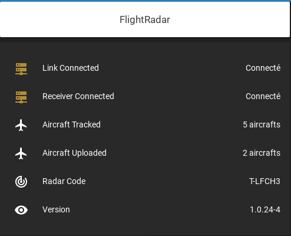

# Configuration Home Assistant 

 

## Equipements
### Matériels
* [Orange pi plus 2e](http://www.orangepi.org/orangepiplus2e/) (x2)
* Raspberry Pi 1 (x1)

### Contrôleurs 
* Zigbee - [Zigate USB](https://zigate.fr/produit/zigate-ttl/)
* Zwave - [EVERSPRING SA413](https://www.espace-domotique.fr/fr/transmetteur/everspring-controleur-usb-z-wave-plus-everspring-sa413-1-1043.html)
* 433Mhz - [Rflink](http://www.rflink.nl/) et [DIY PCB](https://github.com/azrod/diy-rflink-pcb) 
* Infrarouge - [Xiaomi IR remote](https://fr.gearbest.com/smart-home/pp_229556.html)
* Bluetooth - [Clé Bluetooth]

### Eclairages 
* Ampoules [Milight](http://www.milight.com/)[2,4Ghz]
* DIY Milight Gateway [Github esp8266_milight_hub](https://github.com/sidoh/esp8266_milight_hub)[WiFi]
* [Sonoff Basic R2](https://sonoff.tech/product/wifi-diy-smart-switches/basicr2) avec [Esphome](https://esphome.io/)[WiFi]
* [Fibaro Dimmer 2](https://www.fibaro.com/fr/products/dimmer-2/) pour piloter un interrupteur mural[ZWave]
* [Qubino Flush Dimmer](https://qubino.com/products/flush-dimmer/) pour piloter un interrupteur mural[Zwave]

### Télécommandes 
* [Xiaomi Mijia Switch](https://fr.aliexpress.com/item/32825685057.html) [Zigbee] (x2)
* [Télécommande Sonoff 433](https://sonoff.tech/product/accessories/rm433) [433Mhz]

### Alarme 
* [Securitas Direct] - Utilisation d'un [custom component](https://github.com/segalion/securitasdirect) qui s'appuie sur l'API mobile de MyVerisure 

### Capteurs
#### Ouvertures
* [Xiaomi mijia Door sensor](https://fr.aliexpress.com/item/32829391822.html) [Zigbee] (x2)

#### Température / Humidité / Pression
* [Xiaomi mijia sensor](https://fr.aliexpress.com/item/32714410866.html) [Zigbee] (x8) - Capteur Température et humidité
* [Xiaomi aqara sensor](https://fr.aliexpress.com/item/32714410866.html) [Zigbee] (x1) - Capteur Température, humidité et pression
* Oregon Scientific [433Mhz] - Capteur Température, humidité avec une plage de fonctionnement important (congélateur)
* [DIY Station météo](https://www.instructables.com/id/Solar-Powered-WiFi-Weather-Station-V20/)[Wifi] - Portage de la partie logiciel sur Esphome

#### Présences
* [Xiaomi mijia IR sensor](https://fr.aliexpress.com/item/32828696729.html) [Zigbee] (x4)

#### Fuites 
* [Xiaomi Aqara weather](https://fr.gearbest.com/smart-home/pp_229556.html) [Zigbee] (x2)

### Prises connectées 
* [Sonoff Basic R2](https://sonoff.tech/product/wifi-diy-smart-switches/basicr2) avec [Esphome](https://esphome.io/) [WiFi]
* [Sonof R20](https://sonoff.tech/product/wifi-smart-plugs/s20) avec [Esphome](https://esphome.io/) [WiFi]

### Aspirateur 
* [Xiaomi Mi Robot Vaccum S50](https://fr.aliexpress.com/item/32850707934.html) [WiFi]

### TeleInfo 
* [WirelessTeleInfo](https://github.com/Domochip/WirelessTeleInfo) [Wifi] DIY

## Tracking des avions - FlighRadar 

J'ai installé une antenne TV de type DVB-T pour pouvoir suivre l'activité aérienne civile au dessus de chez moi. ([Antenne - Amazon](https://www.amazon.fr/gp/product/B013Q94CT6/ref=ppx_yo_dt_b_asin_title_o00_s00?ie=UTF8&amp;psc=1&_encoding=UTF8&tag=azrod0d-21&linkCode=ur2&linkId=f952cf91e04350a5fe42c3dac0a421a0&camp=1642&creative=6746)). Afin de partager avec la communauté je transmet les informations au site [FlightRadar](https://www.flightradar24.com/) qui permet d'avoir un compte premium sur le site. FlightRadar fournis un soft pour transmettre les données [FR24Feed](https://www.flightradar24.com/share-your-data) et s'appuie sur le soft dump1090 pour pouvoir lire et décoder les informations de l'antenne. Installé sur un RaspberryPI 1 c'est un bon moyen pour utiliser ce vieux RaspberryPI. 

Dump1090 fournis une page web avec des informations en Json pour récupérer les informations sur le tracking en temps réel. Voici l'intégration dans lovelace. 

Tous les fichiers de configuration pour HomeAssistant sont dsponible dans `packages/fr24/`

